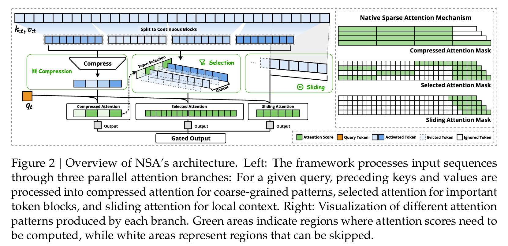

## NSA(北大&DeepSeek, 202502)

* 梁文锋亲自指导,ACL 2025 best paper
* paper: https://arxiv.org/abs/2502.11089
* 长上下文的算力平权，使开源模型达到闭源模型才能满足的上下文窗口
* 将文本处理速度提高了11倍，结合了算法创新和硬件改进，提高效率而不牺牲硬件性能
* 三个并行注意力分支来处理输入序列，每组QKV会分别被处理成三种不同的注意力方式：
  * Compressed Attention：用于捕捉粗粒度的整体模式
  * Selected Attention：专注于重要的词块
  * Sliding Attention：获取局部上下文信息
  *
