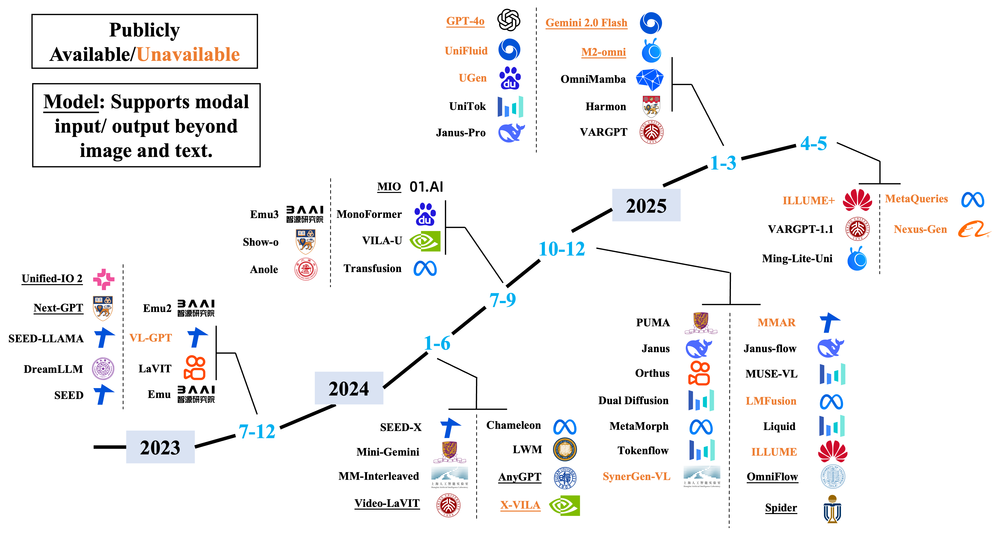

## Unified Multimodal Understanding and Generation Models:Advances, Challenges, and Opportunities(阿里，202505）

* paper：https://arxiv.org/pdf/2505.02567
* github：https://github.com/AIDC-AI/Awesome-Unified-Multimodal-Models
* 统一模型三大架构：
  * 基于扩散的架构（diffusion models)
  * 基于自回归的架构(autoregressive models）
  * 融合自回归与扩散机制的混合架构（fused AR + diffusion models）
* 自回归模型根据其模态编码方法进一步划分为四个子类：
  * 基于像素的编码（pixel-based encoding）
  * 基于语义的编码（semantic-based encoding）
  * 基于可查询的编码（learnable query-based encoding）
  * 混合编码（hybrid encoding）
* 整理数据集和评测基准
* LLM与多模态理解模型主要采用自回归架构，基于解码器唯一结构和下一词元预测机制实现序列化文本生成
* 
* 典型的统一多模态架构通常包含三个核心组件：
  * 模态特定编码器：将不同输入模态投影到同一表示空间
  * 模态融合骨干网络：整合多模态信息并实现跨膜太推理
  * 模态特定解码器：再期望的模态中生成输出
